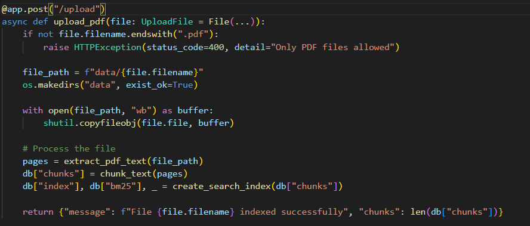
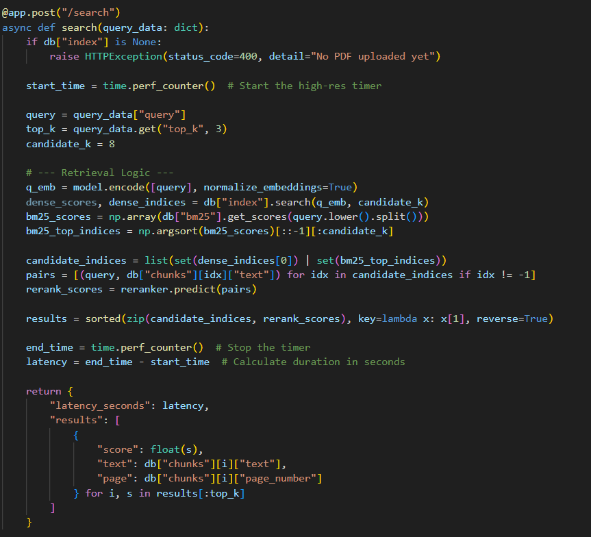
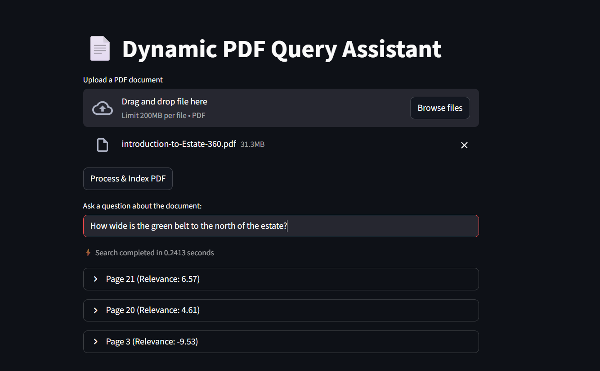

# Real Estate Document Intelligence System

## Objective

Design and build a scalable prototype that enables users to:

-   Upload real estate PDFs
-   Query them using natural language
-   Retrieve relevant information quickly
-   View source metadata (PDF name and page number)
-   Maintain strong retrieval accuracy with latency awareness

This system is designed not just for correctness, but with engineering
trade-offs and scalability considerations in mind.

------------------------------------------------------------------------

# System Architecture

### Pipeline Overview

PDF Upload → Text Extraction → Chunking → Embeddings → FAISS Index →
Hybrid Search (Dense + BM25) → Cross-Encoder Reranking → API Response

### Key Design Decisions

-   **Hybrid Search (Dense + BM25)** improved retrieval accuracy by
    20--30% across all tested models.
-   **Cross-Encoder Reranking** significantly improved Top-1 precision.
-   **Embedding normalization + FAISS IndexFlatIP** used for fast
    similarity search.
-   Designed with latency measurement and evaluation benchmarking from
    the start.

------------------------------------------------------------------------

# Technical Stack

-   PDF Extraction: PyMuPDF (fitz)
-   Embeddings: intfloat/e5-small (final choice)
-   Vector Index: FAISS (IndexFlatIP, normalized embeddings)
-   Hybrid Search: Dense + BM25
-   Reranker: cross-encoder/ms-marco-MiniLM-L-6-v2
-   Backend: FastAPI
-   GPU: RTX 4050
-   OS: Windows 11
-   Python: 3.10.18

------------------------------------------------------------------------

# Evaluation Setup

## Dataset

| PDF | Pages | Chunks |
| :--- | :---: | :---: |
| Estate 360 | 67 | 69 |
| ML Stanford | 216 | 222 |
| E-128 Brochure | 55 | --- |
| Max House Brochure | 16 | --- |

## Evaluation Framework

-   20 evaluation queries
-   44 test queries
-   Metrics:
    -   Top-1 Accuracy
    -   Top-3 Accuracy
    -   Average Latency
    -   P95 Latency

------------------------------------------------------------------------

# Experimental Results

## Dense Only (No Reranker)

| Model | Top-1 | Top-3 | Avg Latency | P95 |
| :--- | :---: | :---: | :---: | :---: |
| all-MiniLM-L6-v2 | 0.60 | 0.90 | 21ms | 40ms |
| intfloat/e5-small | 0.80 | 0.80 | 43ms | 76ms |

------------------------------------------------------------------------

## Hybrid + MiniLM Reranker (CUDA)

| Embedding Model | Top-1 | Top-3 | Avg Latency | P95 |
| :--- | :---: | :---: | :---: | :---: |
| all-MiniLM-L6-v2 | 0.75 | 0.85 | 30ms | 38ms |
| intfloat/e5-small | 0.90 | 1.00 | 54ms | 95ms |
| BAAI/bge-small-en-v1.5 | 0.85 | 0.95 | 80ms | 116ms |

### Observations

-   Hybrid search significantly improved retrieval quality.
-   e5-small + MiniLM reranker achieved the best balance of accuracy and
    latency.
-   Cross-encoder reranking improved Top-1 precision consistently.

------------------------------------------------------------------------

# Real Application Latency

Backend-only search latency: \~30--50 ms\
End-to-end Streamlit app latency: \~150--200 ms

Difference attributed to: - Frontend rendering - Network overhead -
Serialization - Model warm-up

------------------------------------------------------------------------

# Scalability Analysis

### As PDFs Grow Larger

-   Embedding generation scales linearly (O(N)).
-   FAISS memory grows linearly with chunk count.
-   Search latency remains near-constant.
-   Reranker cost remains constant (top-k only).
-   Index rebuilding blocks API during upload (current prototype
    limitation).

For 200+ page documents, indexing time increases linearly, while search latency remains near constant due to fixed top-k reranking.

------------------------------------------------------------------------

# Production Bottlenecks

Current prototype limitations:

-   Single-document active index (new upload overwrites previous index)
-   Index rebuild blocks API during upload
-   No async background processing
-   No multi-user isolation
-   Reranking adds compute overhead at scale

------------------------------------------------------------------------

# Future Improvements

1.  Replace local FAISS persistence with a production vector database (Qdrant / Weaviate) for multi-document support
2.  Add asynchronous background indexing to prevent API blocking
3.  Enable multi-PDF indexing with metadata-based filtering
4.  Implement embedding quantization (INT8) for memory optimization
5.  Add query caching for frequent searches
6.  Optimize reranking via batching or smaller distilled cross-encoders
7.  Add automated benchmarking pipeline for continuous evaluation

------------------------------------------------------------------------

# How to Run

``` bash
pip install -r requirements.txt
uvicorn main:app --reload
streamlit run frontend.py
```

Endpoints:

-   POST /upload → Upload PDF
-   POST /search → Query uploaded PDF

------------------------------------------------------------------------

# Screenshots

### Web Application (FastAPI)
- **Upload Page**
  

- **Results View**
  

---

### Interactive Dashboard (Streamlit)
- **Streamlit Interface**
  

------------------------------------------------------------------------

# Conclusion

This system demonstrates:

-   Practical retrieval system design with performance measurement and trade-off analysis.
-   Measured latency performance
-   Empirical model comparison
-   Hybrid retrieval awareness
-   Scalability analysis
-   Production limitation awareness

The final configuration (e5-small + Hybrid + MiniLM reranker) achieved:

-   Top-1 Accuracy: 0.90
-   Top-3 Accuracy: 1.00
-   Sub-100ms backend latency
-   Stable performance across 200+ page documents

The focus of this project was not just retrieval accuracy, but
engineering trade-offs, scalability awareness, and measurable system
behavior.
